# PROJECT 3: MERN STACK IMPLEMENTATION

# Documentation of Project-3

# Simple to-do Application on MERN Web Stack

### Update Ubuntu

`sudo apt update`

### Upgrade Ubuntu

`sudo apt upgrade`

### Getting the location of Node.js software from Ubuntu Repositories

`curl -fsSL https://deb.nodesource.com/setup_18.x | sudo -E bash -`

### Installing node.js on the server

`sudo apt-get install -y nodejs`

## The command above installs both nodejs and npm.

### Verifying node and npm installation respectively

`node -v` 

`npm -v`

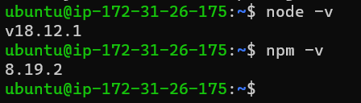

### Creating a new directory for to-do Project and confirming the directory

`mkdir Todo`

`ls`

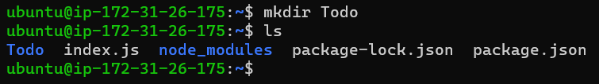

### Changing Directory to Todo:

`cd Todo`

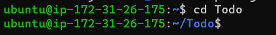

### Initializing Project by creating package.json file

`npm init`

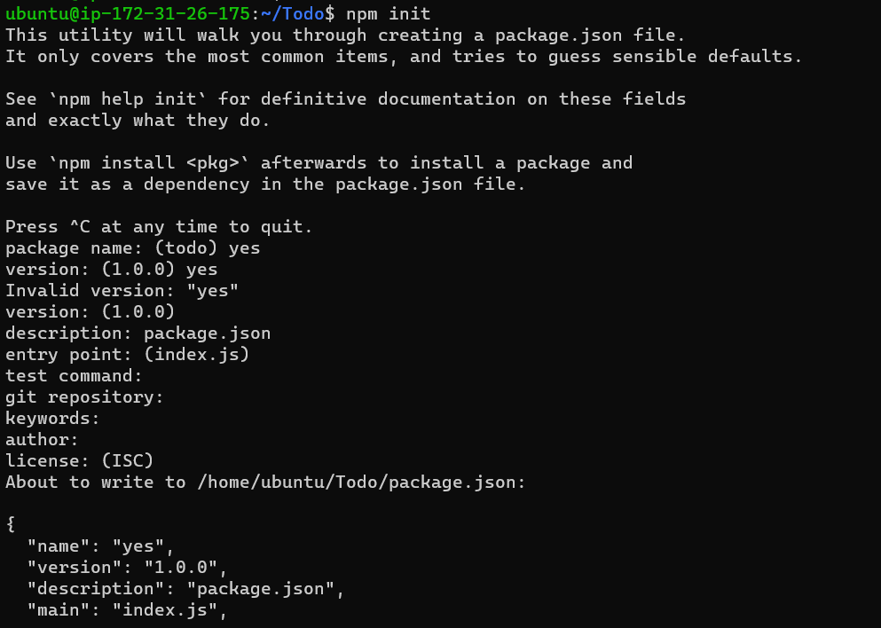

### Running the ls command to confirm package.json file created

`ls`

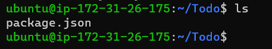

### Installing ExpressJs

`npm install express`

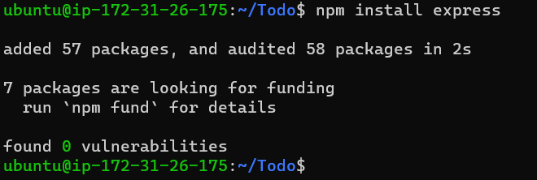

### creating a file index.js with command:

`touch index.js`

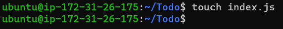

### Running 'ls' to confirm just created file in present working directory

`ls`

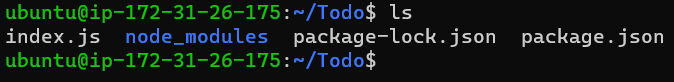

### Installing the dotenv module

`npm install dotenv`

### Opening the index file

`vim index.js`

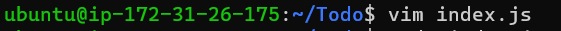

### The code below was entered and saved into the file: 

`const express = require('express');`
`require('dotenv').config();`

`const app = express();`

`const port = process.env.PORT || 5000;`

`app.use((req, res, next) => {`
`res.header("Access-Control-Allow-Origin", "\*");`
`res.header("Access-Control-Allow-Headers", "Origin, X-Requested-With, Content-Type, Accept");`
`next();`
`});`

`app.use((req, res, next) => {`
`res.send('Welcome to Express');`
`});`

`app.listen(port, () => {`
`console.log(`Server running on port ${port}`)`
`});`

### Opening terminal in the same directory as index.js file and running:

`node index.js`

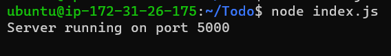

### Creating an inbound rule for port 5000

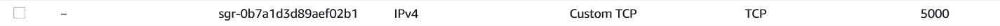

Opening browser and trying to access server’s Public IP followed by port 5000:

`http://3.91.6.77:5000`

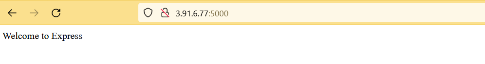

### Routes

### There are three actions that our To-Do application needs to be able to do:

 ### 1. Create a new task
 ### 2. Display list of all tasks
 ### 3. Delete a completed task

### Each task will be associated with some particular endpoint and will use different standard HTTP request methods: POST, GET, DELETE.
### For each task, we need to create routes that will define various endpoints that the To-do app will depend on. So we create a folder routes:

`mkdir routes`

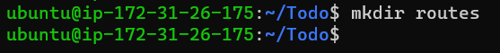

### Changing directory to routes folder.

`cd routes`

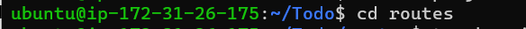

### creating a file api.js with command below:

`touch api.js`

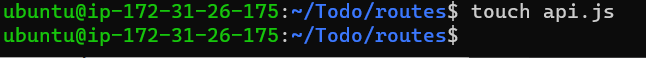

### Opening the file with:

`vim api.js`

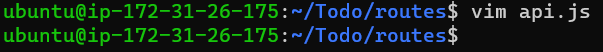
### Code below was entered and saved:

`const express = require ('express');`
`const router = express.Router();`

`router.get('/todos', (req, res, next) => {`

`});`

`router.post('/todos', (req, res, next) => {`

`});`

`router.delete('/todos/:id', (req, res, next) => {`

`})`

`module.exports = router;`

## MODELS

### Changing directory to /Todo/ and installing Mongoose

`cd ~/Todo/`

`npm install mongoose`

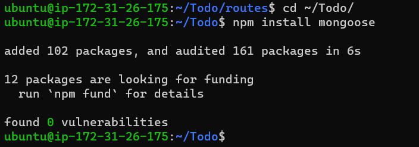

### Creating new folder 'models'

`mkdir models`

### Changing directory into the newly created ‘models’ folder

`cd models`

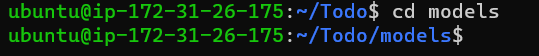

### creating a file named todo.js inside models folder

`touch todo.js`

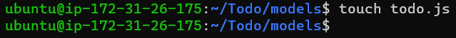

# All three commands above can be defined in one line to be executed consequently with help of && operator, like this:

`mkdir models && cd models && touch todo.js`
### Opening created file with `vim todo.js`, then inserting and saving the code below:

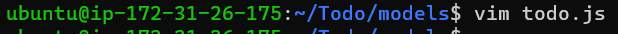

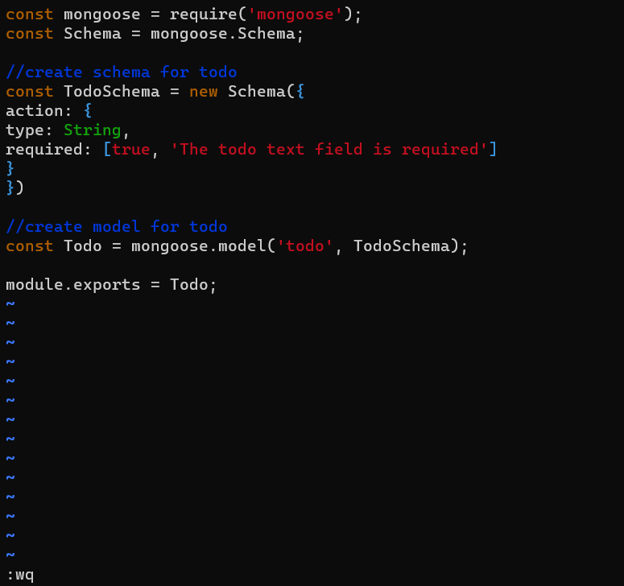

`const mongoose = require('mongoose');`
`const Schema = mongoose.Schema;`

`//create schema for todo`
`const TodoSchema = new Schema({`
`action: {`
`type: String,`
`required: [true, 'The todo text field is required']`
`}`
`})`

`//create model for todo`
`const Todo = mongoose.model('todo', TodoSchema);`

`module.exports = Todo;`

### Now we need to update routes from the file api.js in ‘routes’ directory to make use of the new model.

### Changing directory to routes

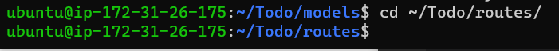

### In Routes directory, api.js will be opened with `vim api.js`, the code contained will be deleted with `:%d` command, then the code below will be entered and saved:

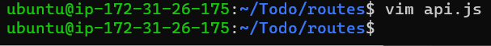

`const express = require ('express');`
`const router = express.Router();`
`const Todo = require('../models/todo');`

`router.get('/todos', (req, res, next) => {`

`//this will return all the data, exposing only the id and action field to the client`
`Todo.find({}, 'action')`
`.then(data => res.json(data))`
`.catch(next)`
`});`

`router.post('/todos', (req, res, next) => {`
`if(req.body.action){`
`Todo.create(req.body)`
`.then(data => res.json(data))`
`.catch(next)`
`}else {`
`res.json({`
`error: "The input field is empty"`
`})`
`}`
`});`

`router.delete('/todos/:id', (req, res, next) => {`
`Todo.findOneAndDelete({"_id": req.params.id})`
`.then(data => res.json(data))`
`.catch(next)`
`})`

`module.exports = router;`