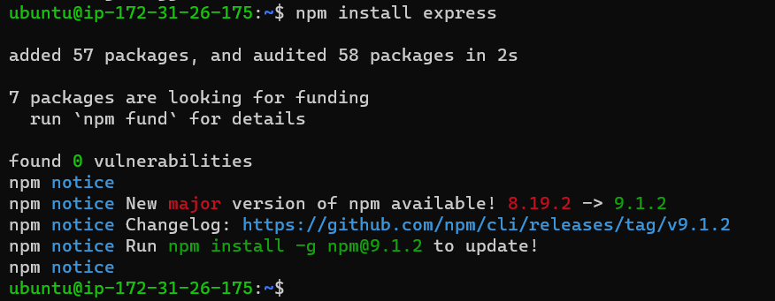
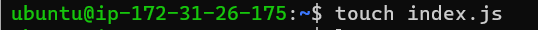
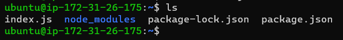

# PROJECT 3: MERN STACK IMPLEMENTATION

# Documentation of Project-3

# Simple to-do Application on MERN Web Stack

### Update Ubuntu

`sudo apt update`

### Upgrade Ubuntu

`sudo apt upgrade`

### Getting the location of Node.js software from Ubuntu Repositories

`curl -fsSL https://deb.nodesource.com/setup_18.x | sudo -E bash -`

### Installing node.js on the server

`sudo apt-get install -y nodejs`

## The command above installs both nodejs and npm.

### Installing ExpressJs

`npm install express`

### creating a file index.js with command:

`touch index.js`

### Running 'ls' to confirm just created file in present working directory

`ls`

